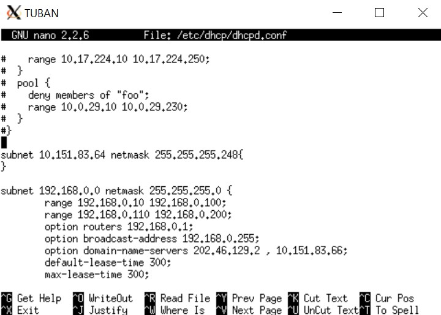

# Jarkom_Modul3_Praktikum_B07
## Kelompok
* 05111840000060 Edo Dwi Yogatama
* 05111840000091 Vincentius Tanubrata

#### 1. Anri adalah seorang mahasiswa tingkat akhir yang sedang mengerjakan TA mengenai DHCP dan Proxy. Bu Meguri sebagai dosen pembimbing Anri memberikan tugas pertamanya, yaitu untuk membuat topologi jaringan demi kelancaran TA-nya. Anri sudah pernah mempelajari teknik Jaringan Komputer sehingga Anri dapat membuat topologi tersebut dengan mudah. Bu Meguri memerintahkan Anri untuk menjadikan SURABAYA sebagai router, MALANG sebagai DNS Server, TUBAN sebagai DHCP server, serta MOJOKERTO sebagai Proxy server, dan UML lainnya sebagai client. Bu Meguri berpesan pada Anri untuk menyusun topologi secara hati-hati dan memperhatikan gambar topologi yang diberikan Bu Meguri.
* membuat topologi awal pada `topology.sh` dengan isi seperti berikut


* router : surabaya ,server : Tuban, Malang, Mojokerto , client : sidoarjo, gresik, banyuwangi, madiun

* lalu lakukan `bash topology.sh` untuk membuka umlnya
* topology berhasil dibuat

#### 2. Karena TUBAN jauh dari client, maka perlu adanya perantara agar bisa saling terhubung. SURABAYA ditunjuk sebagai perantara (DHCP Relay) antara DHCP Server dan client. Kriteria lain yang diminta Bu Meguri pada topologi jaringan tersebut adalah: Seluruh client TIDAK DIPERBOLEHKAN menggunakan konfigurasi IP Statis.
* setting konfigurasi pada server tuban
* lakukan `apt-get update` lalu install `apt-get install isc-dhcp-server
`
* lakukan konfigurasi pada `/etc/default/isc-dhcp-server`
* set interface menjadi `INTERFACES="eth0"`


* lalu isi konfigurasi pada `/etc/dhcp/dhcpd.conf` untuk masing-masing subnet
* install dhcp relay pada surabaya sebagai perantara dari server Tuban ke client dengan `apt-get install isc-dhcp-relay -y `
* lalu arahkan dhcp-relay tersebut ke server tuban.

#### 3. Client pada subnet 1 mendapatkan range IP dari 192.168.0.10 sampai 192.168.0.100 dan 192.168.0.110 sampai 192.168.0.200.
* setting konfigurasi range pada subnet 1 di `/etc/dhcp/dhcpd.conf` dengan 
```
range '192.168.0.10' '192.168.0.100';
range '192.168.0.100' '192.168.0.110';
```

#### 4. Client pada subnet 3 mendapatkan range IP dari 192.168.1.50 sampai 192.168.1.70.
* setting konfigurasi range pada subnet 3 di `/etc/dhcp/dhcpd.conf` dengan 
```
range '192.168.1.50 ' '192.168.1.70';
```

#### 5. Client mendapatkan DNS Malang dan DNS 202.46.129.2 dari DHCP
* setting konfigurasi domain-name-server pada subnet 1 dan 3 menjadi berikut 
```
option domain-name-servers '202.46.129.2', '10.151.83.66';
```
#### 6. Client di subnet 1 mendapatkan peminjaman alamat IP selama 5 menit, sedangkan client pada subnet 3 mendapatkan peminjaman IP selama 10 menit.
* Setting konfigurasi waktu pada subnet 1 selama 5 menit(300 detik) dan pada subnet 2 selama 10 menit(60 detik)

pada subnet 1 : 
```
default-lease-time 300;
max-lease-time 300;
```
pada subnet 2 : 
```
default-lease-time 600;
max-lease-time 600;
```

berikut adalah gambar no 2-6 untuk isi `/etc/dhcp/dhcpd.conf`




* ini adalah hasil bound range pada client yang telah di set pada nomor 3 dan 4


#### 7. Bu Meguri adalah dosbing yang suka overthinking. Ia tidak ingin jaringan lokalnya terhubung ke internet secara langsung. Sehingga ia memberi tugas tambahan pada Anri untuk membuatkan Proxy sebagai penghubung jaringan lokal ke internet. Ada beberapa ketentuan yang harus dipenuhi dalam pembuatan Proxy ini. Pertama, akses ke proxy hanya bisa dilakukan oleh Anri sendiri sebagai user TA.  User autentikasi milik Anri memiliki format: User : userta_yyy Password : inipassw0rdta_yyy

#### 8. Anri sudah menjadwal pengerjaan TA-nya etiap hari Selasa-Rabu pukul 13.00-18.00. Bu Meguri membatasi penggunaan internet Anri hanya pada jadwal yang telah ditentukan itu saja. Maka diluar jam tersebut, Anri tidak dapat mengakses jaringan internet dengan proxy tersebut.

#### 9. Jadwal bimbingan dengan Bu Meguri adalah etiap hari Selasa-Kamis pukul 21.00 - 09.00 keesokan harinya (sampai Jumat jam 09.00).

#### 10.  Agar Anri bisa fokus mengerjakan TA, etiap dia mengakses google.com, maka akan di redirect menuju monta.if.its.ac.id agar Anri selalu ingat untuk mengerjakan TA🙂

#### 11. Untuk menandakan bahwa Proxy Server ini adalah Proxy yang dibuat oleh Anri,  Bu Meguri meminta Anri untuk mengubah error page default squid menjadi seperti berikut:

#### 12. Karena Bu Meguri dan Anri adalah tipe orang pelupa, maka untuk memudahkan mereka, Anri memiliki ide ketika menggunakan proxy cukup dengan mengetikkan domain janganlupa-ta.yyy.pw dan memasukkan port 8080. 
